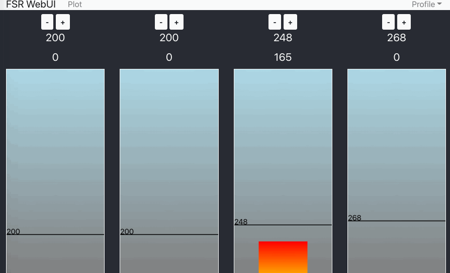
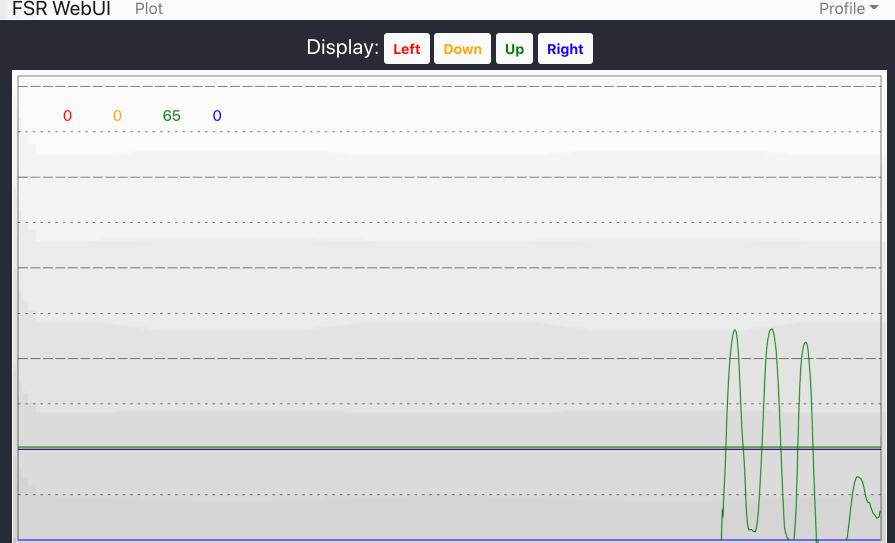

# Teejusb's FSR Guide
A complete software package for FSR dance pads.  
Join the [discord](https://discord.gg/RamvtwuEF2) for any questions/suggestions

## Features
- React web UI to customize sensitivity 
- Profiles & persistence
- Light support

## Screenshots





## Requirements
- A [Teensy](https://www.pjrc.com/store/index.html) or Arduino
  - uses native keyboard library for Arduino and Joystick library for Teensy
- Python 3.6+
    - virtualenv
- Node 12+
  - yarn

## Hardware setup
Follow a guide like [fsr-pad-guide](https://github.com/Sereni/fsr-pad-guide) or [fsr](https://github.com/vlnguyen/itg-fsr/tree/master/fsr) to setup your Arduino/Teensy with FSRs.

## Firmware setup
1. Install [Arduino IDE](https://www.arduino.cc/en/software) (skip this if you're using OSX as it's included in Teensyduino)
1. Install [Teensyduino](https://www.pjrc.com/teensy/td_download.html) and get it connected to your Teensy and able to push firmware via Arduino IDE
1. In Arduinio IDE, set the `Tools` > `USB Type` to `Serial + Keyboard + Mouse + Joystick` (or `Serial + Keyboard + Mouse`)
1. In Arduinio IDE, set the `Tools` > `Board` to your microcontroller (e.g. `Teensy 4.0`)
1. In Arduinio IDE, set the `Tools` > `Port` to select the serial port for the plugged in microcontroller (e.g. `COM5` or `/dev/something`)
1. Copy in the code from [fsr.ino](./fsr.ino)
1. By default, [A0-A3 are the pins](https://forum.pjrc.com/teensy40_pinout1.png) used for the FSR sensors in this software. If you aren't using these pins [alter the SensorState array](fsr.ino#L204-L209)
1. Push the code to the board

### Testing and using the serial monitor
1. Open `Tools` > `Serial Monitor` to open the Serial Monitor
1. Within the serial monitor, enter `t` to show current thresholds.
1. You can change a sensor threshold by entering numbers, where the first number is the sensor (0-indexed) followed by the threshold value. For example, `3180` would set the 4th sensor to 180 thresholds.  You can change these more easily in the UI later.
1. Enter `v` to get the current sensor values.
1. Putting pressure on an FSR, you should notice the values change if you enter `v` again while maintaining pressure.


## UI setup
1. Install [Python](https://www.python.org/downloads/)
1. Install [Node](https://nodejs.org/en/download/)
    - Install [yarn](https://classic.yarnpkg.com/en/docs/install#windows-stable). A quick way to do this is with NPM: `npm install -g yarn`
1. Within [server.py](./webui/server/server.py), edit the `SERIAL_PORT` constant to match the serial port shown in the Arduino IDE (e.g. it might look like `"/dev/ttyACM0"` or `"COM1"`)
    - You also may need to [modify](https://github.com/teejusb/fsr/pull/1#discussion_r514585060) the `sensor_numbers` variable.
1. Open a command prompt (or terminal) and navigate to `./webui/server` with `cd webui/server`
1. Run `python -m venv venv` (on Windows you may need to replace `python` with `py`)
1. Run `venv\Scripts\activate` (on Linux you run `source venv/bin/activate`)
1. Run `pip install -r requirements.txt` to install dependencies
1. Then move to the `./webui` directory by doing `cd ..`
1. Run `yarn install && yarn build && yarn start-api`
    - On Linux, you'll also need to edit the `start-api` script in `./webui/package.json` to reference `venv/bin/flask` instead of `venv/Scripts/flask`

The UI should be up and running on http://localhost:5000 and you can use your device IP and the port to reach it from your phone (e.g. http://192.168.0.xxx:5000 )


## Troubleshooting 
- If you use localhost in your browser and if the UI looks choppy, try using your local IP instead
- If you see the following error, ensure the "Serial Monitor" isn't already open in Arduino IDE `serial.serialutil.SerialException: [Errno 16] could not open port /dev/cu.usbmodem83828101: [Errno 16] Resource busy: '/dev/cu.usbmodem83828101`
- If you notice that your input is delayed and perhaps that delay increases over time, you can sometimes rectify that by restarting the server. Close your `start-api` window and run it again.

## Tips
### Make a desktop shortcut (Windows)
Create a new text file called `start_fsrs.bat` and place it on your desktop.
```bat
start "" http://YOUR_PC_NAME_OR_IP:5000/
cd C:\Users\YourUser\path\to\fsr\webui
yarn start-api
```
Now you can just click on that file to open the UI and start the server.